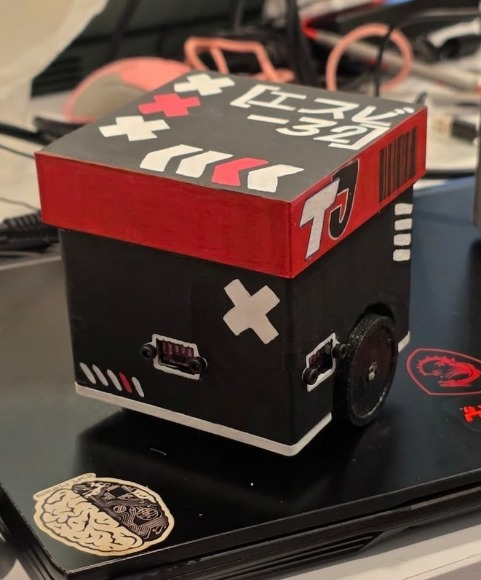
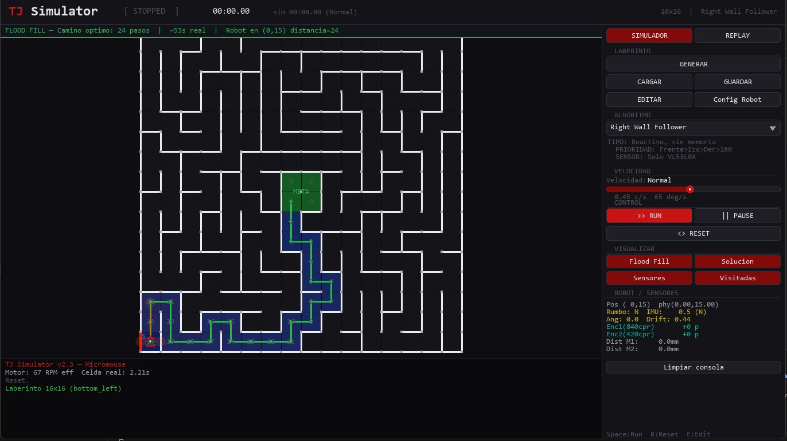

<div align="center">

```
████████╗     ██╗      ███████╗██╗███╗   ███╗██╗   ██╗██╗      █████╗ ████████╗ ██████╗ ██████╗ 
╚══██╔══╝     ██║      ██╔════╝██║████╗ ████║██║   ██║██║     ██╔══██╗╚══██╔══╝██╔═══██╗██╔══██╗
   ██║        ██║█████╗███████╗██║██╔████╔██║██║   ██║██║     ███████║   ██║   ██║   ██║██████╔╝ 
   ██║   ██   ██║╚════╝╚════██║██║██║╚██╔╝██║██║   ██║██║     ██╔══██║   ██║   ██║   ██║██╔══██╗ 
   ██║   ╚█████╔╝      ███████║██║██║ ╚═╝ ██║╚██████╔╝███████╗██║  ██║   ██║   ╚██████╔╝██║  ██║ 
   ╚═╝    ╚════╝        ╚══════╝╚═╝╚═╝     ╚═╝ ╚═════╝ ╚══════╝╚═╝  ╚═╝   ╚═╝    ╚═════╝ ╚═╝  ╚═╝
```

# TJ Simulator — Micromouse

**ESP32-S3 · PlatformIO · Python/Pygame · Flood Fill · A\* · Telemetría Dual**

---

[](https://www.espressif.com/)
[](https://www.python.org/)
[](https://www.pygame.org/)
[](https://platformio.org/)
[](https://www.arduino.cc/)
[](LICENSE)

</div>

---

## ¿Qué es esto?

**TJ Simulator** es un ecosistema completo para el desarrollo de un robot **Micromouse** competitivo, creado en la **Universidad Anáhuac Mayab** para la competencia **ROBGAM 2026**. El proyecto une dos mundos en un solo repositorio:

Prototypo 02 del TinyJerry

<!-- Imagen Principal: Prototipo Físico -->




Un **simulador físico en Python/Pygame** que replica fielmente el comportamiento del robot — motores GA12-N20 con encoders duales de distinto CPR, IMU MPU6500 con integración de gyro, sensores ToF VL53L0X con raycast DDA, y PID de triple lazo — todo animado a 60 fps con física continua desacoplada del timer lógico.

Un **firmware PlatformIO para ESP32-S3** que implementa los mismos algoritmos del simulador: Flood Fill exploratorio (Run 1), A* óptimo (Run 2) y A* a velocidad máxima (Run 3), con mapa persistente en EEPROM y telemetría por Serial que puede reproducirse en el simulador fotograma a fotograma.

El laberinto estándar de competencia es **16×16 celdas de 18 cm**, con robot de máximo **10×10 cm**. Los motores operan a ~67 RPM efectivos (100 RPM @ 6V, alimentados a 4V), cubriendo una celda en ~2.2 s durante exploración.

ESTE SOFTWARE SOLO SE UTILIZÓ PARA OPTIMIZAR LOS ALGORITMOS PREVIOS A TENER UN LABERINTO FÍSICO. AL MOMENTO DE LA COMPETICIÓN SE MANTIENE DESCONECTADO EN TODO MOMENTO.

---

⚠️ Declaración de Competitividad y Modelos 3D

Nota del Equipo: El código fuente público en este repositorio corresponde únicamente a versiones de prueba y herramientas de simulación. Este software se utilizó de manera intensiva para optimizar la lógica y los algoritmos matemáticos previos a disponer del laberinto físico. No representa el código competitivo final del equipo.

Durante los intentos oficiales en la competencia, el robot opera de forma 100% autónoma, y todos los sistemas de telemetría y conexión con este simulador se mantienen estrictamente desconectados.

🛠️ Modelos 3D (STL): Si te interesa la estructura mecánica de nuestro Micromouse, los archivos de fabricación del chasis y componentes (T-Rex Competition Edition) están disponibles y documentados en Cults3D:

👉 Descargar Modelos STL y Archivos en Cults3D https://cults3d.com/es/modelo-3d/juegos/competition-micromouse-robot-t-rex-competition-edition-esp32-tof-stl

---

📜 Lineamientos de la Competencia (ROBGAM 2026)

Este ecosistema fue diseñado estrictamente para cumplir con las siguientes directrices oficiales de la categoría Micromouse:

Objetivo: Diseñar y construir un robot autónomo capaz de resolver un laberinto mediante el uso de algoritmos de navegación y toma de decisiones, llegando desde la Salida hasta la Meta en el menor tiempo posible.

Especificaciones Críticas:

Autonomía Total: El robot no podrá ser controlado, asistido, ni calibrado remotamente mientras se encuentre en la pista, mediante ningún tipo de dispositivo externo.

Aislamiento: No se permite el uso de comunicación externa con dispositivos que reciban información fuera del entorno físico del laberinto.

Dimensiones Máximas: Largo 10 cm | Ancho 10 cm | Altura Libre.

Integridad Mecánica: Ninguna parte, accesorio o mecanismo podrá separarse del robot durante la competencia.

Inicio Rápido: El robot deberá estar configurado para funcionar de forma inmediata al inicio de cada intento.

Características

🧠 Simulador Python y Entorno (Open Source)

<div align="center">

</div>
### Simulador Python

| | Función | Detalle |
|---|---|---|
| 🤖 | Física continua | Posición `fx/fy` interpolada ease-out a 60 fps, ángulo `fangle` suavizado |
| 📡 | Sensores VL53L0X | Raycast DDA desde posición sub-celda — beams rotan con el robot en tiempo real |
| 🧭 | IMU MPU6500 | Gyro integrado con deriva simulada, norte virtual, heading IMU vs heading lógico |
| ⚙️ | Encoders duales | M1 cuadratura CPR=840, M2 un canal CPR=420 — distinto mm/count por motor |
| 🔴 | PID triple lazo | Lazo distancia (mm, no counts crudos) + Lazo gyro + Lazo centrado de carril |
| 🗺️ | Generador DFS | Laberinto con entrada única garantizada, zona meta 2×2 centrada, spawn orientado |
| 🧮 | 12 algoritmos | Flood Fill RT, A*, BFS, Dijkstra, Right/Left Wall Follower, Trémaux, Pledge y más |
| 🎮 | Movimiento fluido | Timer lógico desacoplado de animación — encadenamiento en 30% de progreso |
| ✏️ | Modo Editor | Click-Izq toggle pared · Click-Der mover inicio · Shift+Click-Der mover meta |
| 🔧 | Config Robot | Panel editable en vivo: RPM, voltaje, rueda, track, offset Y, sensores — guardable `.ini` |
| 📊 | Modo Fantasma | Replay dual SIM (cyan) vs ESP32 (naranja) con interpolación suave entre waypoints |
| 💾 | Telemetría CSV | Grabación por waypoints, carga dual, comparación visual simultánea |
| 🖥️ | Two-tab UI | Tab **SIMULADOR** y tab **REPLAY** completamente separadas |

### Firmware ESP32-S3

| | Función | Detalle |
|---|---|---|
| 🔁 | Run 1 | Flood Fill exploratorio — descubre paredes con VL53L0X, guarda mapa en EEPROM |
| 🏁 | Run 2 | A\* camino óptimo — tramos rectos sin freno entre celdas (`avanzarRecto`) |
| 🚀 | Run 3 | A\* a `VEL_SPRINT=240` PWM — mismo camino, velocidad máxima |
| 📐 | PID triple lazo | Error distancia en mm + heading del gyro + centrado de carril lateral |
| 🗃️ | EEPROM persistente | Mapa de paredes survives apagado — al prender continúa desde Run 2 directamente |
| 📟 | Telemetría Serial | Una línea por waypoint (FWD/TURN/GOAL) — formato compatible con el simulador |
| 🎮 | Comandos Serial | `B`=borrar mapa · `2`=forzar Run 2 · `R`=reset pos · `T`=toggle tel · `I`=info |

---

## Hardware del robot

### Mapa de pines ESP32-S3-DevKitC-1

| GPIO | Señal | Tipo | Notas |
|---|---|---|---|
| `4` | Motor 1 IN1 | PWM LEDC canal 0 | M1 izquierdo — IN2 es forward (lógica invertida) |
| `5` | Motor 1 IN2 | PWM LEDC canal 1 | |
| `6` | Motor 2 IN3 | PWM LEDC canal 2 | M2 derecho |
| `7` | Motor 2 IN4 | PWM LEDC canal 3 | |
| `8` | Encoder M1 canal A | Input + IRQ CHANGE | Cuadratura — 2 interrupciones |
| `10` | Encoder M1 canal B | Input + IRQ CHANGE | |
| `12` | Encoder M2 canal único | Input + IRQ CHANGE | Debounce 200 µs en ISR |
| `45` | XSHUT VL53L0X IZQ | Output | Apagado secuencial para reasignar dirección I2C |
| `38` | XSHUT VL53L0X CEN | Output | |
| `37` | XSHUT VL53L0X DER | Output | |
| `47` | SCL I2C | I2C @ 400 kHz | |
| `48` | SDA I2C | I2C @ 400 kHz | |

> **I2C Addresses:** VL53L0X IZQ=`0x30` · CEN=`0x31` · DER=`0x32` · MPU6500=`0x68` · TCS34725=`0x29`

> ⚠️ **Arduino Core 2.x** — Usar `ledcSetup()` + `ledcAttachPin()`. La función `ledcAttach()` solo existe en Core 3.x.

### Especificaciones mecánicas (TJ.ini)

| Parámetro | Valor | Derivado |
|---|---|---|
| Motor | GA12-N20 100 RPM @ 6V | |
| Voltaje real de batería | 4 V | RPM efectivos ≈ **67** |
| Gear ratio | 30:1 | |
| PPR Hall (eje motor) | 7 | |
| Diámetro rueda | 40 mm | Circunferencia: 125.66 mm |
| CPR M1 (cuadratura) | **840** counts/rev | `7 × 30 × 4` |
| CPR M2 (un canal) | **420** counts/rev | `7 × 30 × 2` |
| mm/count M1 | **0.1496** | |
| mm/count M2 | **0.2992** | |
| Pulsos/casilla M1 | ~1203 | @ celda de 180 mm |
| Track (entre centros ruedas) | 72 mm | |
| Offset rueda Y | −15 mm | Ruedas detrás del CG → ajuste de arco en giros |
| Sensor frontal | 40 mm adelante del CG | |
| Sensores laterales | 20 mm adelante · 38 mm al costado | |
| Velocidad por celda (exploración) | ~2.2 s | @ VEL_EXPLORE=170 PWM |
| Velocidad giro 90° | ~1.5 s | @ VEL_GIRO=155 PWM |

---

## Algoritmos implementados

| # | Algoritmo | Tipo | Memoria | Óptimo |
|:---:|---|---|---|:---:|
| 1 | Right Wall Follower | Reactivo sin memoria | O(1) | ✗ |
| 2 | Left Wall Follower | Reactivo sin memoria | O(1) | ✗ |
| 3 | **Flood Fill (tiempo real)** | Mapeado incremental BFS | O(N) | ✓ conocido |
| 4 | BFS (camino óptimo) | Grafo completo | O(N) | ✓ |
| 5 | **A\* (A-Star)** | Heurística Manhattan | O(N log N) | ✓ |
| 6 | Trémaux | Exploración DFS con marcas | O(E) | ✗ |
| 7 | Right Wall + Memory | Reactivo con mapa | O(N) | ✗ |
| 8 | Dead End Filling | Preprocesamiento callejones | O(N) | ✓ |
| 9 | Pledge | Escape de obstáculos | O(1) | ✗ |
| 10 | Random Mouse | Aleatorio puro | O(1) | ✗ |
| 11 | Dijkstra | Grafo ponderado | O(N²) | ✓ |
| 12 | Spiral/Chain | Exploración sistemática | O(N) | ✗ |

### Estrategia de competencia — 3 runs

```
Run 1 → Flood Fill    VEL_EXPLORE=170   Explorar laberinto + guardar mapa EEPROM
          ↓  (al llegar a meta: calcula A*, regresa al inicio)
Run 2 → A*            VEL_FAST=215      Camino óptimo descubierto en Run 1
          ↓  (regresa al inicio)
Run 3 → A*            VEL_SPRINT=240    Mismo camino a máxima velocidad
```

> Si el robot se apaga entre runs, la EEPROM conserva el mapa. Al encender de nuevo salta directamente a Run 2.

---

## Instalación

### Simulador Python

```bash
# Clonar repositorio
git clone https://github.com/LMHDPRO/ESP32-MazeSolverSimulator-TJ_Project.git
cd ESP32-MazeSolverSimulator-TJ_Project/tj_simulator

# Instalar dependencias
pip install pygame pyserial

# Ejecutar
python main.py
```

**Dependencias Python:**

| Librería | Versión | Uso |
|---|---|---|
| `pygame` | ≥ 2.6.1 | Renderizado, física, eventos de UI |
| `pyserial` | ≥ 3.5 | Recepción telemetría del ESP32 vía USB Serial |
| `csv` | stdlib | Lectura/escritura de sesiones de telemetría |
| `math` | stdlib | Raycast DDA, interpolación de ángulos, geometría |
| `time` | stdlib | Timers lógicos y marcas temporales de telemetría |
| `pathlib` | stdlib | Gestión de rutas de sesiones CSV |
| `tkinter.filedialog` | stdlib | Diálogos de carga de CSV en la UI de replay |
| `collections.deque` | stdlib | Buffer de consola y cola BFS en algoritmos |

### Firmware ESP32-S3 (PlatformIO)

**1.** Instalar [PlatformIO IDE](https://platformio.org/install/ide?install=vscode) para VS Code.

**2.** Clonar y abrir el proyecto:

```bash
git clone https://github.com/LMHDPRO/ESP32-MazeSolverSimulator-TJ_Project.git
code .
```

**3.** Las dependencias se instalan automáticamente desde `platformio.ini`:

```ini
[env:esp32-s3-devkitc-1]
platform  = espressif32
board     = esp32-s3-devkitc-1
framework = arduino
monitor_speed   = 115200
monitor_filters = esp32_exception_decoder, colorize
upload_speed    = 921600
build_flags =
    -DCORE_DEBUG_LEVEL=1
    -DARDUINO_USB_MODE=1
    -DARDUINO_USB_CDC_ON_BOOT=1
board_build.flash_mode = qio
board_build.flash_size = 8MB
board_build.partitions = default_8MB.csv
lib_deps =
    adafruit/Adafruit BusIO
    adafruit/Adafruit_VL53L0X
    adafruit/Adafruit TCS34725
```

**4.** Subir el firmware:

```bash
pio run --target upload
```

**5.** Verificar en Serial Monitor (115200 baud):

```
[TJ SYSTEM] Booting...
[INIT] ENCODERS ........ A OK | B OK
[INIT] GY-91 ........... OK  (500 muestras calibradas)
[INIT] VL53L0X ......... DER OK | CEN OK | IZQ OK
[INIT] COLOR SENSOR .... DESHABILITADO (meta por posicion)
[SYS] All systems OK
[SYS] RPM_eff=67  vel_max=140 mm/s
[SYS] mm/cnt M1=0.1496  M2=0.2992
[SYS] Casilla M1=1203 cts   Giro90 M1=375 cts
[SYS] Laberinto 10x10  Meta(4-5, 4-5)
[READY]
```

---

## Telemetría

### Protocolo Serial ESP32 → Simulador

El firmware envía **una línea por waypoint** (cada FWD, TURN o GOAL):

```
TEL,<ts_ms>,<event>,<x>,<y>,<heading>,<ang_z>,<enc1>,<enc2>,<izq>,<cen>,<der>
```

| Campo | Descripción |
|---|---|
| `ts_ms` | Timestamp desde arranque del ESP32 (ms) |
| `event` | `FWD` / `TURN_L` / `TURN_R` / `TURN_180` / `GOAL` / `BOOT` |
| `x`, `y` | Posición lógica en el laberinto |
| `heading` | 0=N · 1=E · 2=S · 3=W |
| `ang_z` | Ángulo integrado del gyro (grados) |
| `enc1`, `enc2` | Counts acumulados de M1 y M2 |
| `izq`, `cen`, `der` | Lecturas VL53L0X en mm |

### Replay dual (SIM vs ESP32)

```
1. Tab REPLAY → [ ] GRABAR → ejecutar simulación → detener grabación
2. Correr el robot físico → recoger CSV de telemetría
3. Cargar Sim (cyan) + Cargar ESP32 (naranja)
4. Seleccionar canal: SIM / ESP32 / AMBOS
5. >> REPRODUCIR — ambos robots animados simultáneamente
```

El robot **naranja (ESP32)** se superpone sobre el **cyan (Simulador)** en Modo Fantasma, interpolando entre waypoints con ease-out para mostrar exactamente dónde divergieron las decisiones y tiempos.

---

## Calibración

### Umbrales de pared VL53L0X

```cpp
#define TH_WALL_FRONT  120   // mm — ajustar con el laberinto físico real
#define TH_WALL_SIDE   120
```

### Eje del gyro MPU6500

```cpp
anguloZ += gz * dt;   // cambiar gz por gx o gy si el GY-91 está girado 90°
```

### Color de la meta (TCS34725)

```cpp
tcs.getRawData(&r,&g,&b,&c);
Serial.printf("gn=%.3f  rn=%.3f\n", (float)g/c, (float)r/c);
// Suelo negro típico: gn~0.30  |  Meta (cinta verde): gn~0.40+
```

### PID de avance recto

| Parámetro | Default | Ajustar si... |
|---|---|---|
| `KP_DIST` | `1.8` | Robot zigzaguea lateralmente → reducir |
| `KI_DIST` | `0.04` | Deriva acumulada sistemática → aumentar |
| `KP_GYRO` | `2.5` | Robot no corrige el heading → aumentar |
| `KP_LANE` | `0.25` | Oscilación entre paredes del carril → reducir |

### Memoria A* para diferentes tamaños de laberinto

| Tamaño | RAM A* | Estado |
|---|---|---|
| 10×10 | ~400 B | ✓ |
| 15×15 | ~900 B | ✓ |
| **16×16** (estándar competencia) | ~1.0 KB | ✓ |

El ESP32-S3 dispone de **320 KB RAM libre** — cualquier tamaño de competencia es viable.

---

## Estructura del proyecto

```
TJ-Simulator/
 ├── main.py                  ← punto de entrada
 ├── simulator.py             ← UI Pygame — dos tabs: SIMULADOR / REPLAY
 ├── robot.py                 ← física continua, PID, sensores DDA
 ├── robot_config.py          ← parámetros físicos del robot (editable en UI)
 ├── maze.py                  ← estructura, flood fill, BFS
 ├── maze_gen.py              ← generador DFS + orientación de spawn
 ├── algorithms.py            ← 12 algoritmos de resolución
 ├── config.py                ← constantes visuales y colores
 ├── telemetry.py             ← grabación waypoints + replay interpolado dual
 ├── sessions/                ← CSVs de telemetría guardados automáticamente
 └── firmware/
      ├── src/
      │    └── main.cpp       ← firmware ESP32-S3 (Flood Fill + A* + PID)
      └── platformio.ini      ← configuración de build
```

---

## Comandos Serial (modo desarrollo)

| Comando | Acción |
|---|---|
| `B` | Borrar mapa EEPROM y reiniciar exploración desde cero |
| `2` | Forzar Run 2 (A*) si ya hay mapa guardado en EEPROM |
| `R` | Resetear posición lógica al punto de inicio |
| `T` | Toggle telemetría Serial ON / OFF |
| `I` | Info diagnóstico: pos, heading, runPhase, pathReady |

---

## Créditos de librerías

- [Adafruit VL53L0X](https://github.com/adafruit/Adafruit_VL53L0X) — Adafruit Industries
- [Adafruit TCS34725](https://github.com/adafruit/Adafruit_TCS34725) — Adafruit Industries
- [Adafruit BusIO](https://github.com/adafruit/Adafruit_BusIO) — Adafruit Industries
- [Pygame](https://www.pygame.org/) — Pygame Community

---

## Equipo

<div align="center">

*Proyecto desarrollado en la* **Universidad Anáhuac Mayab** *— Mérida, Yucatán · ROBGAM 2026*

<br>

| | Nombre | |
|:---:|:---|:---:|
| 🧑‍💻 | **José Pardiñaz** | [](https://www.linkedin.com/in/josepardinaz/) |
| 🧑‍💻 | **César Franco** | [](https://www.linkedin.com/in/cesar-franco-flores-a6347630b/) |
| 🧑‍💻 | **Angélica Bonilla** | [](https://www.linkedin.com/in/ang%C3%A9lica-bonilla-velasco-074266262/) |
| 🧑‍💻 | **Diana Ruiz** | [](https://www.linkedin.com/in/dianaruizgarcia861/) |
| 🧑‍💻 | **Luis Avila** | [](https://www.yugioh-card.com/lat-am/wp-content/uploads/2024/05/Banner_2024_LART-notext-SP.png) |
| 🧑‍💻 | **Paul Quintal** | [](https://www.linkedin.com/in/paul-quintal-508baa364/) |
| 🧑‍💻 | **Daniel Pinzón** | [](https://www.linkedin.com/in/jose-daniel-pinzon-vivas/) |
| 🧑‍💻 | **Geovanny Giorgana** | [](https://www.linkedin.com/in/geovanny-giorgana-784465157/) |

<br>

[](https://merida.anahuac.mx/)

</div>

---

## Licencia

Licencia del Simulador (Python): MIT License — Úsalo, modifícalo y distribúyelo libremente.

Licencia de Firmware: Propietario / Uso Exclusivo del Equipo TJ.

<div align="center">
<sub>TJ Simulator · ESP32-S3 Micromouse · Made with ☕ in Mérida, MX</sub>
</div>
